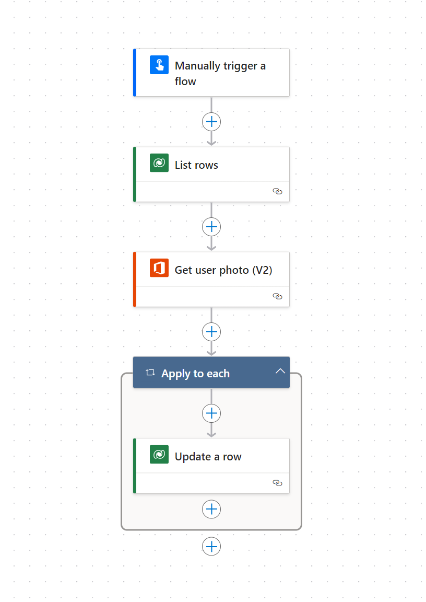

# Update Power Platform Users photo with Microsoft 365 photo

This sample demonstrates how you can synchronize the user photos on the Dataverse table called Users with the photos stored in Microsoft 365.

Post describing step by step how to recreate the flow:
https://douglasromao.com.br/2024/04/01/atualizar-fotos-dos-usuarios-da-power-platform-com-foto-do-microsoft-365-com-power-automate/